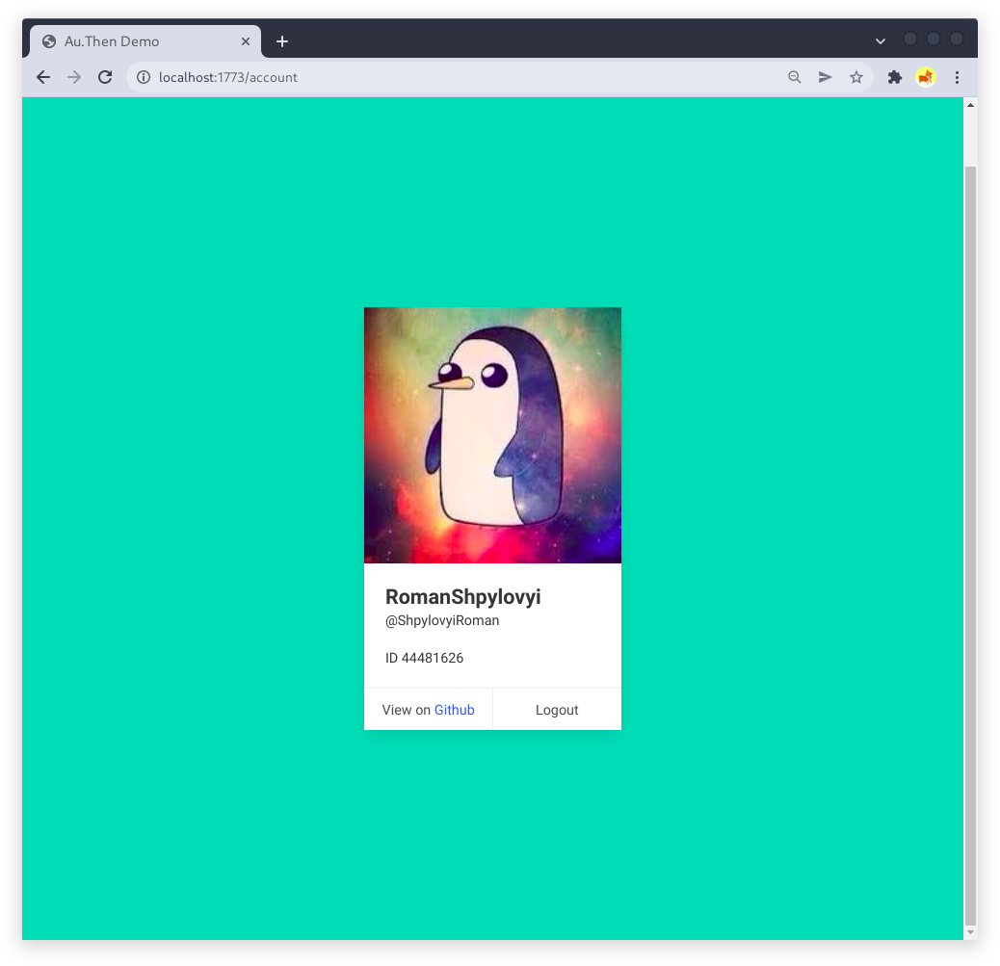

# Au.Then

This demo demonstates the authentication using the OAuth2.0 Github provider.

## Installation

Clone the project and then run:
```bash
$ npm install
```

## Running

The demo requires the following environment variables:

- `GITHUB_CLIENT_ID`
- `GITHUB_CLIENT_SECRET`

Both should be generated on the [github](https://github.com/settings/applications/new).

```bash
export GITHUB_CLIENT_ID=....
export GITHUB_CLIENT_SECRET=....
```

It also requires a session secret key `AU_THEN_SESSION_SECRET`:

```bash
export AU_THEN_SESSION_SECRET=`openssl rand -hex 32`
``` 

You can also change the serving port with `AU_THEN_PORT` variable (default is 1773);

To run the project:
```bash
node index.js
```

## Endpoints

- `/` - redirects to the `/login` page, if not authenticated, and `/account` if is.

- `/login` - allows authentication through the Github OAuth interface.

- `/account` - display account information if authenticated.

- `/auth/github` - redirect to Github for authentication.

- `/auth/callback/github` - the callback for the Github authentication. Redirect to `/`.

- `/logout` - logouts and redirects to `/login` page.

## Example

- Login page
  

- Redirecting to github
  

- Success
  


## Dockerfile

You can run this demo using docker and docker compose. The credentials are defined in the `docker-compose.yaml` file just for the demo purposes, but you can change them in the same way as described above.

To run the demo:

```bash
$ docker compose up
```

And after building the image, go to the http://localhost:1773/ page.
